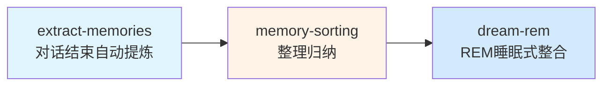

# openclaw-memory-skills
> 从 CC 逆向提取，移植到 OpenClaw 的一套完整记忆系统 Skill：**extract-memories → memory-sorting → dream (REM)**

[](LICENSE)
[](https://openclaw.org/)

## 📖 简介

从 CC 源码逆向提取，移植到 OpenClaw 的一套完整记忆系统 Skill，实现 AI 助手「越用越懂你」：



### 🎯 核心设计

| 阶段 | Skill | 功能 | 触发 |
|------|-------|------|------|
| **增量提炼** | `extract-memories` | 对话结束自动提炼本轮对话关键记忆写入每日文件 | 对话结束自动 |
| **整理归纳** | `memory-sorting` | 👗 像换季整理衣柜一样检测重复/过时/冲突，生成提案等你审批 | 手动触发 |
| **REM整合** | `dream-rem` | 🧠 像 REM 睡眠期一样定时深度整合记忆，让记忆常读常新 | 自动（≥ 24h + ≥ 5会话）/手动 |

## ✨ 效果

- ✅ 彻底解决「每次对话都要重新说一遍背景」痛点
- ✅ 记忆自动增长，自动整理，始终保持干净
- ✅ 按日期归档 + 按主题整合，既保留完整过程，又方便快速查找
- ✅ AI 只做提案，最终决定权始终在你手里，安全可靠

## 📦 安装

### 方法 1: ClawhHub 安装（推荐）

在 OpenClaw 技能市场搜索并安装各技能名称：

| 技能 | ClawhHub 搜索关键词 |
|------|---------------------|
| extract-memories | `extract-memories` |
| memory-sorting | `memory-sorting` |
| dream-rem | `dream-rem` |

### 方法 2: GitHub URL 安装

将仓库地址直接丢给 OpenClaw：
```
https://github.com/Jofiction918/openclaw-cc-contrib
```

### 方法 3: 手动安装

```bash
mkdir -p ~/.openclaw/skills/
cp -r extract-memories ~/.openclaw/skills/
cp -r memory-sorting ~/.openclaw/skills/
cp -r dream-rem ~/.openclaw/skills/
```

## 📝 使用说明

| 技能 | 自动触发 | 手动触发 | 触发短语 |
|------|:-------:|:---------|:---------|
| **extract-memories** | ✅ 对话结束 | `/extract-memories` | `提取记忆` / `提炼记忆` |
| **memory-sorting** | ❌ | `/memory-sorting` | `整理记忆` / `记忆整理` / `梳理记忆` |
| **dream-rem** | ✅ ≥24h + ≥5会话 | `/dream-rem` | `深度整理记忆` / `梦境整理` / `整合记忆` |

### 功能简介

- **提炼**：对话结束后，自动提炼本轮对话中的关键决策/偏好/技术方案，写入 `memory/YYYY-MM-DD.md` 持久化保存
- **整理**：扫描所有记忆文件，自动检测重复/过时/冲突内容，生成修改提案等你审批后执行
- **整合**：定时深度整合，将每日增量信息合并到主题文件，删除过时内容，保持记忆系统整洁有序

## 🎯 项目信息

- 提取来源: CC 2.1.88
- 移植适配: [真维斯 @ Weavemind](https://weavemind.com)
- 许可证: MIT

---

*克隆/fork 欢迎 stars 🌟
